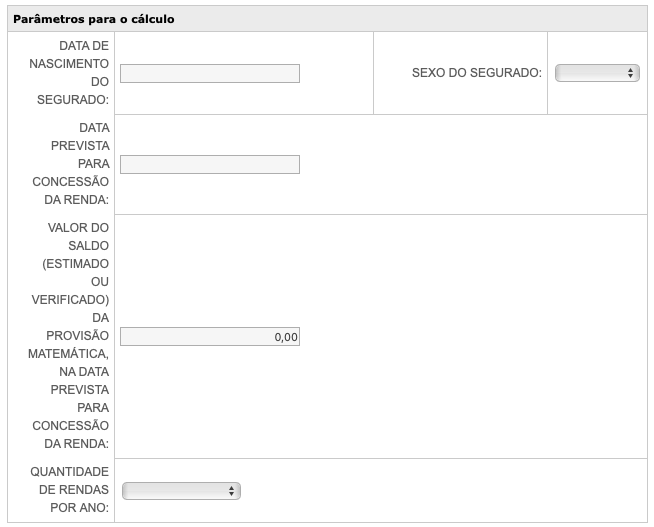

# Challenge Backend

## Objetivos
O objetivo desse Challenge é testar a sua capacidade e criatividade para extrair, transformar e carregar as informações limpa de um site em uma base de dados.

Iremos trabalhar com os dados abertos da SUSEP - Superintendência de Seguros Privados - que, apesar de voltada para seguros, também regula a parcela de planos e fundos de investimentos de previdência privada.

O conjunto de dados abertos se encontra seguinte link:
https://dados.gov.br/organization/superintendencia-de-seguros-privados-susep

Mais informações:
http://www.susep.gov.br/menu/informacoes-ao-publico/planos-e-produtos/previdencia-complementar-aberta#planopgbl

No dataset de "Consulta de Produtos", temos o [Dicionário de Dados](http://dados.susep.gov.br/olinda-ide/servico/produtos/versao/v1/documentacao) com a documentação dos campos que são retornados nos registros. Além disso, tem também o [link](http://dados.susep.gov.br/olinda-ide/servico/produtos/versao/v1/odata/DadosProdutos?$format=json) para o "Registro dos produtos de seguros, previdência ..." que é a lista dos produtos propriamente dita.

## Regras de Negócio

A primeira tarefa é capturar esses dados, em Python, através da lib [requests](https://requests.readthedocs.io/en/master/) e salvar esse JSON na sua máquina (ambiente local).

A partir desse documento, filtrar todos os Número de Processo SUSEP no qual o `tipoproduto` seja "PLANO DE PREVIDÊNCIA" (ver dicionário acima), em seguida, buscar o Regulamento do Processo no link abaixo e baixar:
http://www.susep.gov.br/menu/consulta-de-produtos-1

O documento PDF deve ser baixado na sua máquina (ambiente local).

A partir disso, precisamos extrair as seguintes informações do PDF e salvar um novo JSON.

**Exemplo de Processo SUSEP:**
15414.607577/2020-12
15414.900943/2013-72

**Exemplo Processo SUSEP nº:** 15414.900943/2013-72

**Características**
**CNPJ da Entidade:** 51.990.695/0001-37
**Nome da Entidade:**  BRADESCO VIDA E PREVIDÊNCIA S.A.
**Descrição do Processo:** VGBL INDIVIDUAL - Renda fixa
**Data de Distribuição:** 14/10/2013
**Tábua Atuarial Masculina:** BR-EMSsb
**Tábua Atuarial Feminina:** BR-EMSsb
**Taxa de Carregamento:** 0% Cobrado quando da efetivação de pedidos de resgate e/ou portabilidade
**Taxa de Juros:** 0%
**Percentual de Reversão:** 0%
**Status na SUSEP:** ARQUIVADO/ARQUIVO GERAL

**Tipos de renda**
**Pagamento único:** SIM
**Mensal temporária (máximo de 600 meses):** SIM
**Mensal prazo certo:** SIM
**Mensal vitalícia:** SIM
**Mensal vitalícia com prazo mínimo garantido:** SIM
**Mensal vitalícia reversível ao beneficiário indicado:** SIM
**Mensal vitalícia reversível ao cônjuge com continuidade aos menores (maioridade aos 24):** SIM
**Mensal vitalícia reversível ao cônjuge:** N/A
**Mensal reversível aos menores:** N/A

**Da aplicação dos recursos**
(Art. 54. Os recursos do plano serão aplicados em um dos seguintes FIEs)

**CNPJ Fundo | Nome Fundo | Taxa de Administração**
17.488.983/0001-50 BRADESCO FUNDO DE INVESTIMENTO EM COTAS DE FUNDOS DE INVESTIMENTO RENDA FIXA I-A 1,9 %
17.488.691/0001-17 BRADESCO FUNDO DE INVESTIMENTO EM COTAS DE FUNDOS DE INVESTIMENTO RENDA FIXA II-A 1,9 %
17.517.216/0001-21 BRADESCO FUNDO DE INVESTIMENTO EM COTAS DE FUNDOS DE INVESTIMENTO RENDA FIXA III-A 1,5 %
17.517.250/0001-04 BRADESCO FUNDO DE INVESTIMENTO EM COTAS DE FUNDOS DE INVESTIMENTO RENDA FIXA IV-A 1,2 %
17.517.268/0001-06 BRADESCO FUNDO DE INVESTIMENTO EM COTAS DE FUNDOS DE INVESTIMENTO RENDA FIXA V-A 1 %
17.999.961/0001-54 BRADESCO FUNDO DE INVESTIMENTO RENDA FIXA MÁSTER IV PREVIDÊNCIA 0 %

**Parâmetros técnicos**
**Valor mínimo da provisão matemática de benefícios a conceder:** R$ 500,00
**Prazo de Carência:** 6 meses
**Carência para Portabilidade:** 60 dias
**Carência para Portabilidade na própria Entidade:** 60 dias

### Histórico de Documentos
- Baixar e salvar todos os documentos na consulta: http://www.susep.gov.br/menu/consulta-de-produtos-1
- Salvar também a Data de Início de Comercialização e Data de Fim de Comercialização.
- O JSON salvo, com as informações extraídas do documento PDF, tem que ter o nome legível das variáveis em INGLÊS.

## Extra _(não é obrigatório, avaliaremos como um extra)_
Outra possibilidade é extrair parte dessa informações, a partir do processo Exemplo Processo SUSEP, do seguinte link:
http://www.susep.gov.br/menu/servicos-ao-cidadao/calculo-vgbl

O único problema é o reCAPTCHA, que previne o scrapper.
De qualquer maneira, a coisa mais importante aqui é o cálculo a partir da tábua atuarial. 
Por exemplo: Renda Mensal Vitalicia. Mais importante que pegar essas informações, dado que podem ser obtidas pelo PDF, é modelar essa memória de cálculo.
Assim, esse Challenge extra é conseguir modelar o cálculo da Renda Mensal Vitalicia a partir das informações obtida na leitura do PDF e inputs a seguir (contidos no site):

## O que será avaliado
- Organização de code base, tanto código quanto arquivos;
- Manipulação de listas e dicionários.

