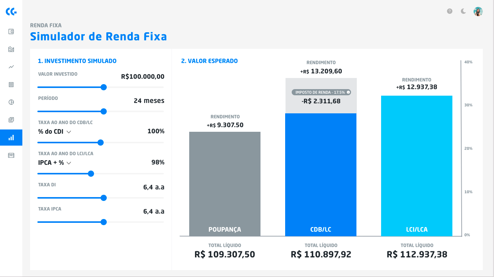

# Challenge Frontend

## Objetivos

Desenvolver uma calculadora capaz de realizar a simulação de títulos de Renda Fixa.
- O usuário deverá ser capaz de alterar o resultado apresentado no gráfico, utilizando os Sliders à esquerda;
- A aplicação deverá fazer uma requisição HTTP para o endpoint das configurações dos Sliders e salvá-las na Store. Aconselho a utilização de um Mock HTTP Server como por exemplo o [json-server](https://github.com/typicode/json-server).

Exemplo do formato da response da HTTP request:

    {
        "minInvestValue": 1,
        "maxInvestValue": 1000000,
        "defaultInvestValue": 100000,
        "stepInvestValue": 5000,
    
        "minPeriod": 1,
        "maxPeriod": 120,
        "defaultPeriod": 25,
        "stepPeriod": 1,
    
        "minCdiPercentRate": 0.1,
        "maxCdiPercentRate": 2,
        "defaultCdiPercentRate": 1,
        "stepCdiPercentRate": 0.01,
    
        "minCdiPlusRate": -0.03,
        "maxCdiPlusRate": 0.03,
        "defaultCdiPlusRate": 0.01,
        "stepCdiPlusRate": 0.001,
    
        "minIpcaPlusRate": 0.01,
        "maxIpcaPlusRate": 0.15,
        "defaultIpcaPlusRate": 0.05,
        "stepIpcaPlusRate": 0.005,
    
        "minFixedRate": 0.03,
        "maxFixedRate": 0.15,
        "defaultFixedRate": 0.08,
        "stepFixedRate": 0.005,
    
        "minDiRate": 0.01,
        "maxDiRate": 0.20,
        "defaultDiRate": 0.059,
        "stepDiRate": 0.001,
    
        "minIpcaRate": 0.01,
        "maxIpcaRate": 0.20,
        "defaultIpcaRate": 0.035,
        "stepIpcaRate": 0.001,
    
        "rateOptions": [
            "% do CDI",
            "CDI + %",
            "IPCA + %",
            "Prefixado"
        ]
    }

## Regras de Negócio
- Quando o usuário alterar qualquer um dos parametros, os gráfico de barras a direita deverão ser recalculados instantaneamente.
- Nas opções "Taxa ao ano do CDB/LC" e "Taxa ao ano da LCI/LCA" deverá haver uma dropodown list com as opções em "RateOptions".
- Todos os valores a partir de "Taxa ao ano do CDB/LC" deverão usar uma máscara, multiplicando o valor por 100, com duas casa decimais, e com um "%" após o valor.
- Em "Taxa DI" e "Taxa IPCA" além da máscará de %, deverá haver um "a.a." com espaço após o valor.
- Os cálculos deverão ser feitos através de uma combinação do valor investido, período e as taxas.

### Cálculos

- A rentabilidade da poupança é feita da mesma maneira que o "% do CDI", utilizando no entanto sempre uma taxa fixa de 70%.
- A rentabilidade de todas as `rateOptions` é feita achando o fator de cotização e multiplicando pelo valor investido. Este é o Valor Bruto. O valor rendimento é feito subitraindo o Valor Investido do Valor Bruto.
- Fórmula do Fator de cotização do "% do CDI" = `(((1 + CDI)^ (1/252) - 1 ) * "CdiPercent" + 1) ^ (DUs)`
- Fórmula do Fator de cotização do "IPCA+" ou "CDI+" = `((1 + {TAXA IPCA ou TAXA DI}) * (1 + {"IpcaPlus ou CdiPlus"})) ^ (DUs / 252)`
- Fórmula do Fator de cotização do "Prefixado": `(1 + "FixedRate") ^ (DUs / 252)`
- DUs = Número de dias úteis no período. DUs = 21 * número de meses (período)
- Os investimentos "Poupança" e "LCI/LCA" são isentos de imposto de renda, logo o TOTAL LÍQUIDO = VALOR BRUTO.
- Para "CDB/LC" encontra-se o TOTAL LÍQUIDO tirando a alíquota de IR correspondente do Rendimento.
 - Se Período < 6 meses, IR = 22,5%
 - Se 6 meses <= Período < 12 meses, IR = 20%
 - Se 12 meses <= Período < 24 meses, IR = 17,5%
 - Se Período >= 24 meses, IR = 15%
- Exemplo: se Período = 24 meses, Valor Bruto = 110.000 e Valor Investido = 100.000, então Rendimento Bruto = 10.000
- Rendimento Líquido = 10.000 * (1 - 15%) = 10.000 * 85% = 8.500
- Logo: TOTAL LÍQUIDO = 100.000 + 8.500 = 108.500

## Requisitos Técnicos
- O seu código deverá ser compartilhado em um repositório público no Github;
- Você deverá usar React;
- Você poderá usar scaffolds como Create React App, ou framework de componentes como Ant Design ou Materialize, desde que se atente ao que será avaliado.

## O que será avaliado
- Componetização, ou seja, capacidade de reutilização de estilo e comportamento dos componentes;
- Organização de code base, tanto código quanto arquivos;
- Usabilidade.
