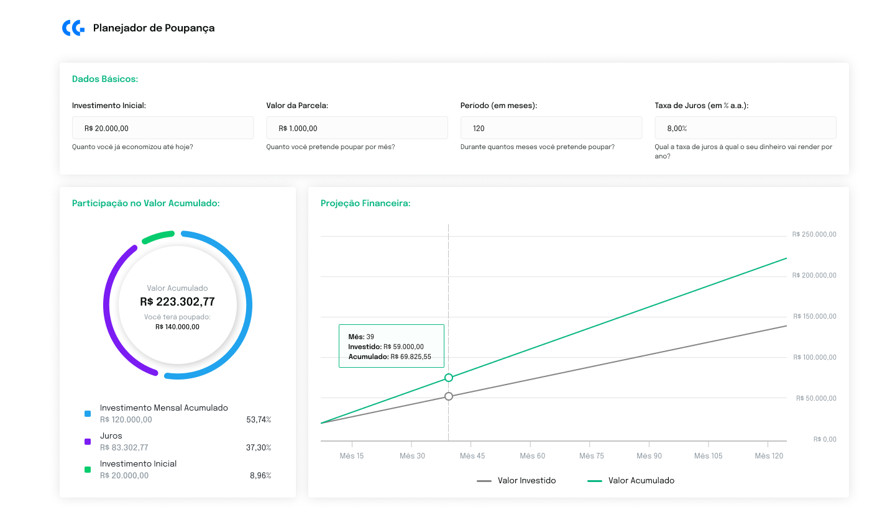

# Challenge Front-end

## Figma

[Design](https://www.figma.com/file/MsoBmvrxZN0PkXNRGiFJBI/Challenge%3A-Planejador-de-Poupan%C3%A7a?node-id=1%3A4)

## Objetivos

- Implementar o Planejador de Poupança conforme o design proposto.

## Definition of Done

- O usuário terá a experiência sugerida pelo designer tanto em um dispositivo desktop quanto mobile, sendo informado sobre o status do sistema (carregamento, sucesso ou falha).
- A aplicação consumirá corretamente APIs GraphQL específicas para cada componente.

## Instruções

- Os dados devem ser formatados exatamente como apresentados no design (ex.: valores percentuais com duas casas decimais seguidas de "%").
- Os inputs do componente Dados Básicos devem apresentar as máscaras indicadas no design.
- Quando todos os inputs forem preenchidos, os componentes de output (Participação no Valor Acumulado e Projeção Financeira) deverão ser atualizados.
- A legenda do gráfico de Participação no Valor Acumulado deve ser ordenada pelo percentual de participação, do maior para o menor.
- Em relação ao gráfico de Projeção Financeira, na interface, as proporções podem estar fora de escala. Então se atente aos valores e não à correspondência entre os pontos e os seus respectivos valores.

## Regras de Negócio

- Investimento Inicial: VI
- Valor da Parcela: VP
- Período (em meses): T
- Taxa de Juros (em % a.a.): J

- O valor acumulado VA (em R$) é dado pelo montante do investimento inicial (II), acrescido das parcelas mensais (VP), pelo período de tempo determinado (T) a uma taxa de juros compostos anual estabelecida (J). Dica: Pesquise como são calculados os juros compostos.
- O percentual de participação P de um valor V (em R$) sobre o valor acumulado VA é dado por P = V / VA.
- O valor investido VT (em R$) é dado por VT = VI + VP \* T ou VT = VA - J.
- O valor investido no mês X (VC) é dado por VC = VI + VP \* X e o valor acumulado no mesmo mês é o montante de juros até o mês X (cálculo de juros compostos).

- Observação: Todos os cálculos deverão ser feitos nos resolvers apropriados!

## Requisitos Técnicos

- Tecnologias
  - Você deve utilizar Next.js sem TypeScript.
  - Você deve estilizar os componentes com Tailwind CSS e, se desejar, utilizar componentes do Ant Design.
  - Para a criação dos gráficos, recomenda-se o uso da biblioteca Highcharts.
  - Você deve criar um endpoint GraphQL com Apollo Server para a implementação das APIs.
  - Você deve criar um cliente GraphQL com Apollo Client para o consumo das APIs.
- Submissão
  - Você deve subir o seu código em um repositorio público no GitHub.
  - O prazo de entrega será estabelecido previamente e caso não seja possível concluir o challenge até a data/hora prevista, o código será considerado até o último commit dentro do prazo.

## Bônus

_Parâmetros não-obrigatórios, mas que serão pontuados!_

- Testes unitários com Jest + React Testing Library.
- Documentação de código com JSDoc.
- Criatividade e previsão de eventuais problemas/inconsistências no código/interface.

## Critérios de Avaliação

- Respeito aos requisitos técnicos estabelecidos.
- Componentização (estruturação e capacidade de reutilização dos componentes).
- Performance da UI e chamadas às APIs.
- Organização do código-fonte e dos arquivos do projeto.
- Fluxo de desenvolvimento.
- Atenção aos detalhes da interface e fidedignidade ao design.
- Responsividade.
- Apresentação, comunicação e legibilidade do projeto.
