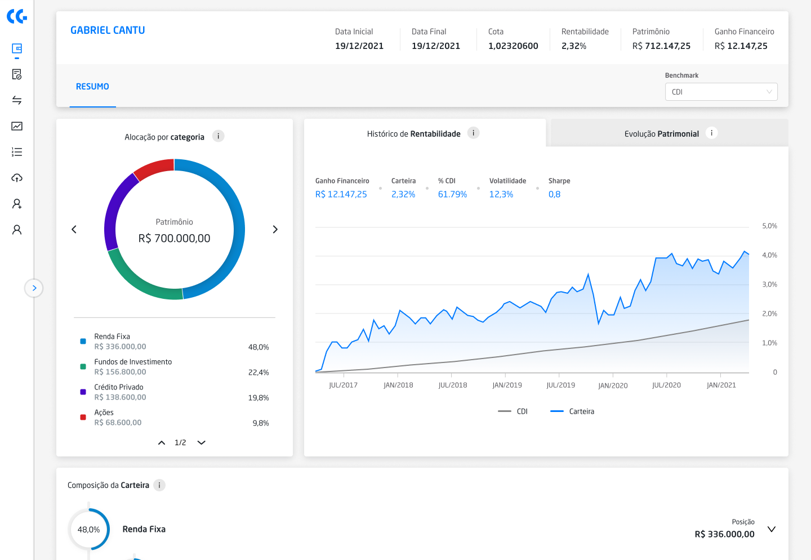

# Challenge Front-end

## Figma

[Design](https://www.figma.com/file/67xGQrWCefY6RVvZaDnlRh/Challenge%3A-Resumo-de-Carteira?node-id=28%3A507)

## Objetivos

- Implementar a página de Resumo de Carteira conforme o design proposto.

## Definition of Done

- O usuário terá a experiência sugerida pelo designer tanto em um dispositivo desktop quanto mobile, sendo informado sobre o status do sistema (carregamento, sucesso ou falha).
- O usuário conseguirá navegar pelos componentes conforme o fluxo proposto pelo designer (aplica-se aos componentes de Alocação, Gráficos de Rentabilidade e Patrimônio e Composição da Carteira).
- A aplicação consumirá corretamente APIs GraphQL específicas para cada componente.
- O usuário conseguirá alternar entre os benchmarks CDI e IBOV, visualizando os componentes com dados atualizados referentes a cada um desses benchmarks.

## Instruções

- Os dados devem ser formatados exatamente como apresentados no design (ex.: percentual com duas casas decimais e data no formato DD/MM/YYYY).
- O filtro “Benchmark” terá duas opções: CDI (default) e IBOV. Toda vez que o usuário alterar o benchmark atual é necessário que todos os componentes sejam atualizados com os dados referentes àquele benchmark. É exatamente por isso que existem dois mocks, um corresponde ao CDI e o outro ao IBOV.
- O componente de Alocação é paginado a partir de quatro itens. Abaixo disso, a paginação sequer aparece.
- O collapse no componente de Composição da Carteira deve funcionar e todos os collapses vêm abertos por padrão.
- No desktop, a sidebar é aberta achatando os componentes à direita.
- No mobile, a sidebar é aberta sobrepondo os componentes da página.

## Requisitos Técnicos

- Tecnologias
  - Você deve utilizar Next.js sem TypeScript.
  - Você deve estilizar os componentes com Tailwind CSS e, se desejar, utilizar componentes do Ant Design.
  - Para a criação dos gráficos, recomenda-se o uso da biblioteca Highcharts.
  - Você deve criar um endpoint GraphQL com Apollo Server para a implementação das APIs.
  - Você deve criar um cliente GraphQL com Apollo Client para o consumo das APIs.
  - Você deve subir um json-server com os mocks fornecidos neste repositório.
- Submissão
  - Você deve subir o seu código em um repositorio público no GitHub.
  - O prazo de entrega será estabelecido previamente e caso não seja possível concluir o challenge até a data/hora prevista, o código será considerado até o último commit dentro do prazo.

## Bônus

_Parâmetros não-obrigatórios, mas que serão pontuados!_

- Testes unitários com Jest + React Testing Library.
- Documentação de código com JSDoc.
- Criatividade e previsão de eventuais problemas/inconsistências no código/interface.

## Critérios de Avaliação

- Respeito aos requisitos técnicos estabelecidos.
- Componentização (estruturação e capacidade de reutilização dos componentes).
- Performance da UI e chamadas às APIs.
- Organização do código-fonte e dos arquivos do projeto.
- Fluxo de desenvolvimento.
- Atenção aos detalhes da interface e fidedignidade ao design.
- Responsividade.
- Apresentação, comunicação e legibilidade do projeto.
