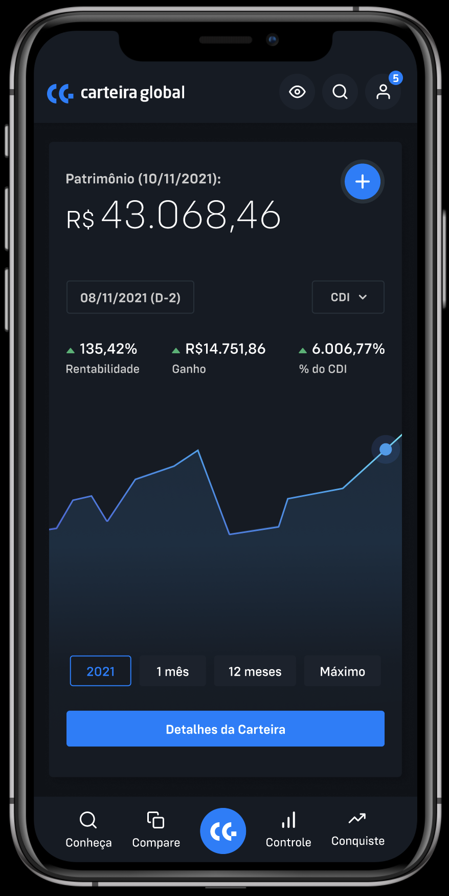

# Challenge Mobile

- [Link para o design (Figma)](https://www.figma.com/file/x0Qp9sG0a08HRkC4jXYFJC/Carteira-Global---Home?node-id=0%3A1)

## Objetivos

Desenvolver a tela de carteira consolidada do Carteira Global. O usuário deverá abrir uma tela conforme os componentes que estão no design do Figma.

## Regras de Negócio
- `Header` e o `FooterMenu` conforme design.
- Todos os componentes devem ser alimentados com base no consumo de uma fake REST API usando o [json-server](https://github.com/typicode/json-server).
- Fique livre para criar os retornos das APIs que serão consumidas.
- Gráficos devem ser dinâmicos com tooltips.

## Requisitos Técnicos
- O seu código deverá ser compartilhado em um repositório público no Github.
- Você deverá usar React Native.
- Utilização de alguma lib de fluxo de dados para trabalhar com a alimentação dos dados até os componentes.

## O que será avaliado
- Componetização, ou seja, capacidade de reutilização de estilo e comportamento dos componentes.
- Organização de code base, tanto código quanto arquivos.
- Fidelidade ao Design.
- Usabilidade.
